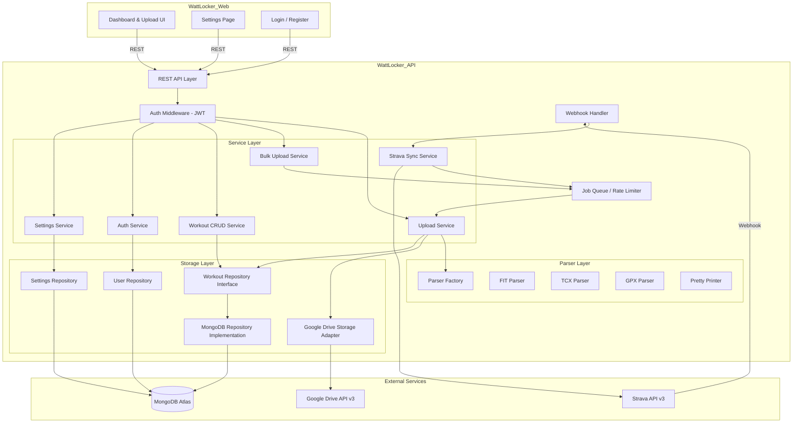
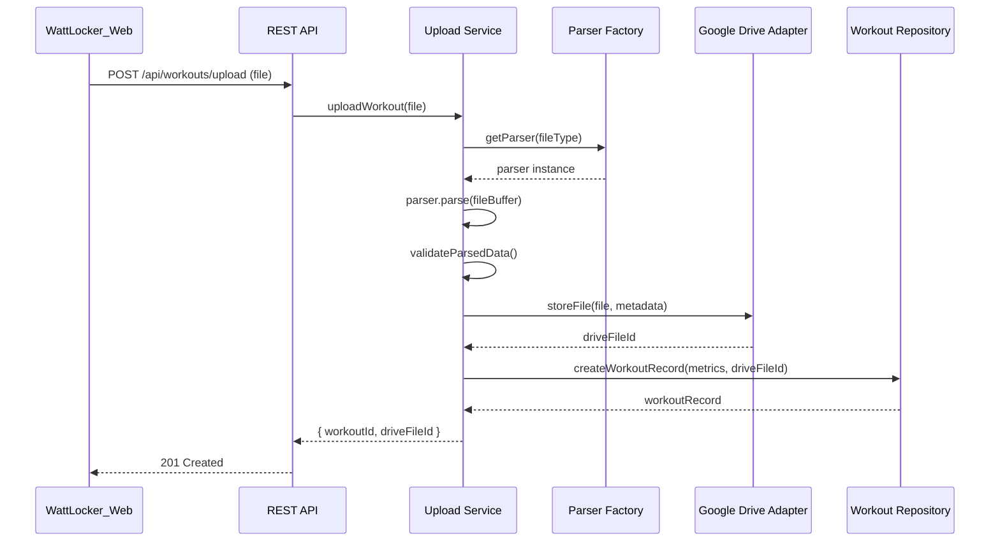

# Design Document: Cycle Analyzer

## Overview

The Cycle Analyzer feature provides the core data pipeline for Watt Locker: ingesting cycling workout files (FIT, TCX, GPX), storing raw files in Google Drive for data sovereignty, parsing structured metrics into a MongoDB time-series database, and exposing CRUD operations via a REST API. It also integrates with Strava for automatic workout sync via webhooks.

The system follows a layered architecture with clear separation between:
- **Transport layer** — REST API endpoints, webhook handlers
- **Service layer** — Business logic, orchestration, rate limiting
- **Parser layer** — Format-specific file parsing and pretty-printing
- **Storage layer** — Repository abstractions for database and file storage

Key design decisions:
1. **Repository pattern** for database access — enables future migration from MongoDB to TimescaleDB/InfluxDB without changing business logic
2. **Strategy pattern** for file parsers — each format (FIT, TCX, GPX) implements a common parser interface
3. **Queue-based bulk processing** — bulk uploads and Strava backfills use an internal job queue with throttling
4. **Google Drive as source of truth for raw files** — the database stores derived metrics; the original file is always recoverable

## Architecture



### Request Flow: Single File Upload



### Request Flow: Strava Webhook

```mermaid
sequenceDiagram
    participant Strava as Strava API
    participant WH as Webhook Handler
    participant SS as Strava Sync Service
    participant Q as Job Queue
    participant US as Upload Service

    Strava->>WH: POST /api/webhooks/strava (event)
    WH->>WH: validateWebhookSignature()
    WH->>SS: handleActivityEvent(event)
    SS->>SS: checkDuplicate(activityId)
    alt Not duplicate
        SS->>Q: enqueue(downloadAndIngest, activityId)
        Q->>SS: processJob()
        SS->>Strava: GET /activities/{id}/streams (export)
        Strava-->>SS: workoutFile (FIT/TCX)
        SS->>US: uploadWorkout(file, source="strava")
    else Duplicate
        SS->>SS: log("Skipping duplicate")
    end
    WH-->>Strava: 200 OK
```



## Components and Interfaces

### Parser Interface

```typescript
interface WorkoutParser {
  /** Parse raw file buffer into structured workout data */
  parse(buffer: Buffer): Promise<ParsedWorkout>;
  
  /** Check if this parser supports the given file extension/MIME type */
  supports(fileType: string): boolean;
}

interface WorkoutPrettyPrinter {
  /** Format a parsed workout back into file representation */
  print(workout: ParsedWorkout): Promise<Buffer>;
  
  /** The output format this printer produces */
  outputFormat: WorkoutFileFormat;
}

interface ParserFactory {
  /** Get appropriate parser for the given file type */
  getParser(fileType: string): WorkoutParser;
  
  /** Get pretty printer for the given format */
  getPrinter(format: WorkoutFileFormat): WorkoutPrettyPrinter;
}

type WorkoutFileFormat = 'fit' | 'tcx' | 'gpx';
```

### Workout Repository Interface

```typescript
interface WorkoutRepository {
  /** Create a new workout record with time-series metrics */
  create(workout: WorkoutRecord): Promise<WorkoutRecord>;
  
  /** Find a workout by its unique identifier */
  findById(id: string): Promise<WorkoutRecord | null>;
  
  /** List workouts with pagination, sorting, and filtering */
  findMany(query: WorkoutQuery): Promise<PaginatedResult<WorkoutRecord>>;
  
  /** Update workout metadata (not time-series data) */
  update(id: string, updates: Partial<WorkoutMetadata>): Promise<WorkoutRecord>;
  
  /** Delete a workout and its associated time-series data */
  delete(id: string): Promise<void>;
  
  /** Check if a workout with matching start time and duration exists */
  findDuplicate(startTime: Date, durationSeconds: number): Promise<WorkoutRecord | null>;
  
  /** Insert time-series metric data points for a workout */
  insertMetrics(workoutId: string, metrics: MetricDataPoint[]): Promise<void>;
  
  /** Query metrics within a time range */
  queryMetrics(query: MetricQuery): Promise<MetricDataPoint[]>;
}

interface WorkoutQuery {
  page: number;
  pageSize: number;
  sortBy?: 'date' | 'duration' | 'distance';
  sortOrder?: 'asc' | 'desc';
  dateFrom?: Date;
  dateTo?: Date;
  activityType?: string;
  dataSource?: string;
}

interface MetricQuery {
  workoutId?: string;
  timeFrom: Date;
  timeTo: Date;
  metricTypes?: MetricType[];
}
```

### Google Drive Storage Interface

```typescript
interface FileStorageAdapter {
  /** Store a file and return its storage reference */
  store(file: Buffer, metadata: FileMetadata): Promise<StorageReference>;
  
  /** Retrieve a file by its storage reference */
  retrieve(reference: StorageReference): Promise<Buffer>;
  
  /** Delete a file by its storage reference */
  delete(reference: StorageReference): Promise<void>;
  
  /** List files in a given folder path */
  listFiles(folderPath: string): Promise<StorageReference[]>;
  
  /** Remove a file from a folder (used for inbox cleanup) */
  removeFromFolder(reference: StorageReference): Promise<void>;
}

interface FileMetadata {
  fileName: string;
  mimeType: string;
  workoutDate: Date;
  dataSource: string;
}

interface StorageReference {
  fileId: string;
  fileName: string;
  folderPath: string;
  webViewLink?: string;
}
```

### Upload Service Interface

```typescript
interface UploadService {
  /** Upload a single workout file through the full pipeline */
  uploadSingle(file: Buffer, fileName: string, options?: UploadOptions): Promise<UploadResult>;
  
  /** Upload multiple files, processing each independently */
  uploadBulk(files: FileInput[], options?: BulkUploadOptions): Promise<BulkUploadResult>;
  
  /** Ingest files from the Google Drive inbox folder */
  ingestFromInbox(): Promise<BulkUploadResult>;
}

interface UploadResult {
  workoutId: string;
  driveFileId: string;
  summary: WorkoutSummary;
}

interface BulkUploadResult {
  total: number;
  successful: UploadResult[];
  failed: FailedUpload[];
  inProgress: number;
}

interface FailedUpload {
  fileName: string;
  error: string;
  errorCode: string;
}
```

### Strava Integration Interface

```typescript
interface StravaSyncService {
  /** Handle incoming webhook event from Strava */
  handleWebhookEvent(event: StravaWebhookEvent): Promise<void>;
  
  /** Manually trigger sync of all missing activities */
  syncHistorical(userId: string): Promise<BulkUploadResult>;
  
  /** Register webhook subscription with Strava */
  registerWebhook(callbackUrl: string): Promise<void>;
  
  /** Validate webhook verification request */
  verifyWebhook(challenge: string, verifyToken: string): string;
}

interface StravaWebhookEvent {
  object_type: 'activity' | 'athlete';
  object_id: number;
  aspect_type: 'create' | 'update' | 'delete';
  owner_id: number;
  subscription_id: number;
  event_time: number;
}
```

### Authentication Interface

```typescript
interface AuthService {
  /** Register a new user */
  register(email: string, password: string): Promise<AuthResult>;
  
  /** Authenticate user and return JWT tokens */
  login(email: string, password: string): Promise<AuthResult>;
  
  /** Refresh an expired access token using a valid refresh token */
  refreshToken(refreshToken: string): Promise<AuthResult>;
  
  /** Validate a JWT access token and return the user context */
  validateToken(token: string): Promise<UserContext>;
}

interface AuthResult {
  accessToken: string;       // Short-lived (e.g., 15 minutes)
  refreshToken: string;      // Longer-lived (e.g., 7 days)
  expiresIn: number;         // Access token TTL in seconds
  user: UserProfile;
}

interface UserContext {
  userId: string;
  email: string;
}

interface UserProfile {
  id: string;
  email: string;
  createdAt: Date;
}
```

### Settings Interface

```typescript
interface SettingsService {
  /** Get user settings, creating defaults if none exist */
  getSettings(userId: string): Promise<UserSettings>;
  
  /** Update user settings (partial update) */
  updateSettings(userId: string, updates: Partial<UserSettings>): Promise<UserSettings>;
}

interface UserSettings {
  userId: string;
  
  // Google Drive paths
  driveStoragePath: string;      // Default: "WattLocker"
  driveInboxPath: string;        // Default: "WattLocker/Inbox"
  
  // Connected data sources
  connectedSources: ConnectedSource[];
  
  updatedAt: Date;
}

interface ConnectedSource {
  provider: DataSource;
  connected: boolean;
  connectedAt?: Date;
  oauthTokenEncrypted?: string;
}
```

### REST API Endpoints

| Method | Endpoint | Auth | Description |
|--------|----------|------|-------------|
| POST | `/api/auth/register` | No | Register new user |
| POST | `/api/auth/login` | No | Login, returns JWT tokens |
| POST | `/api/auth/refresh` | No | Refresh access token |
| GET | `/api/settings` | JWT | Get user settings |
| PUT | `/api/settings` | JWT | Update user settings |
| POST | `/api/workouts/upload` | JWT | Upload single workout file |
| POST | `/api/workouts/upload/bulk` | JWT | Upload multiple workout files |
| POST | `/api/workouts/ingest/inbox` | JWT | Trigger inbox folder ingestion |
| GET | `/api/workouts` | JWT | List workouts (paginated, filterable) |
| GET | `/api/workouts/:id` | JWT | Get single workout with metrics |
| PUT | `/api/workouts/:id` | JWT | Update workout metadata |
| DELETE | `/api/workouts/:id` | JWT | Delete workout |
| POST | `/api/auth/strava` | JWT | Initiate Strava OAuth flow |
| GET | `/api/auth/strava/callback` | JWT | Strava OAuth callback |
| POST | `/api/strava/sync` | JWT | Manual historical sync |
| GET | `/api/webhooks/strava` | No | Webhook verification (GET) |
| POST | `/api/webhooks/strava` | No | Webhook event receiver |
| GET | `/api/health` | No | Health check |

## Data Models

### WorkoutRecord

```typescript
interface WorkoutRecord {
  id: string;
  userId: string;
  
  // Summary
  activityType: string;          // 'ride', 'virtual_ride', etc.
  startTime: Date;
  endTime: Date;
  durationSeconds: number;
  distanceMeters: number;
  elevationGainMeters: number;
  
  // Averages & Peaks
  avgPowerWatts?: number;
  maxPowerWatts?: number;
  avgHeartRateBpm?: number;
  maxHeartRateBpm?: number;
  avgCadenceRpm?: number;
  avgSpeedMps?: number;
  
  // Source tracking
  dataSource: DataSource;
  sourceActivityId?: string;     // e.g., Strava activity ID
  fileFormat: WorkoutFileFormat;
  
  // Storage references
  driveFileId: string;
  driveWebViewLink?: string;
  
  // Metadata
  title?: string;
  description?: string;
  tags?: string[];
  
  createdAt: Date;
  updatedAt: Date;
}

type DataSource = 'manual' | 'strava' | 'trainingpeaks' | 'garmin';
```

### MetricDataPoint (Time-Series)

```typescript
interface MetricDataPoint {
  timestamp: Date;               // timeField for MongoDB time-series
  workoutId: string;             // metaField
  activityType: string;          // metaField
  dataSource: DataSource;        // metaField
  
  // Measurements (stored as fields in time-series collection)
  heartRateBpm?: number;
  powerWatts?: number;
  cadenceRpm?: number;
  speedMps?: number;
  distanceMeters?: number;
  elevationMeters?: number;
  latitude?: number;
  longitude?: number;
  temperature?: number;
}

type MetricType = 'heartRate' | 'power' | 'cadence' | 'speed' | 'distance' | 'elevation' | 'gps' | 'temperature';
```

### ParsedWorkout (Internal)

```typescript
interface ParsedWorkout {
  /** Summary data extracted from file headers/laps */
  summary: {
    activityType: string;
    startTime: Date;
    endTime: Date;
    durationSeconds: number;
    distanceMeters: number;
    elevationGainMeters: number;
    laps?: LapSummary[];
  };
  
  /** Individual data points (time-series) */
  dataPoints: MetricDataPoint[];
  
  /** Original file format */
  sourceFormat: WorkoutFileFormat;
}

interface LapSummary {
  startTime: Date;
  durationSeconds: number;
  distanceMeters: number;
  avgPowerWatts?: number;
  avgHeartRateBpm?: number;
  maxHeartRateBpm?: number;
}
```

### MongoDB Collection Schema

**Collection: `users`** (standard collection)
```javascript
{
  _id: ObjectId,
  email: String,                  // unique
  passwordHash: String,           // bcrypt hash
  createdAt: ISODate,
  updatedAt: ISODate
}
// Indexes: { email: 1 } (unique)
```

**Collection: `settings`** (standard collection)
```javascript
{
  _id: ObjectId,
  userId: ObjectId,               // references users._id
  driveStoragePath: String,       // default: "WattLocker"
  driveInboxPath: String,         // default: "WattLocker/Inbox"
  connectedSources: [
    {
      provider: String,           // "strava", "trainingpeaks", "garmin"
      connected: Boolean,
      connectedAt: ISODate,
      oauthTokenEncrypted: String
    }
  ],
  updatedAt: ISODate
}
// Indexes: { userId: 1 } (unique)
```

**Collection: `workouts`** (standard collection)
```javascript
{
  _id: ObjectId,
  userId: String,
  activityType: String,
  startTime: ISODate,
  endTime: ISODate,
  durationSeconds: Number,
  distanceMeters: Number,
  elevationGainMeters: Number,
  avgPowerWatts: Number,
  maxPowerWatts: Number,
  avgHeartRateBpm: Number,
  maxHeartRateBpm: Number,
  avgCadenceRpm: Number,
  avgSpeedMps: Number,
  dataSource: String,
  sourceActivityId: String,
  fileFormat: String,
  driveFileId: String,
  driveWebViewLink: String,
  title: String,
  description: String,
  tags: [String],
  createdAt: ISODate,
  updatedAt: ISODate
}
// Indexes: { userId: 1, startTime: -1 }, { userId: 1, sourceActivityId: 1 } (unique sparse)
```

**Collection: `metrics`** (time-series collection)
```javascript
// Time-series collection options:
{
  timeseries: {
    timeField: "timestamp",
    metaField: "meta",
    granularity: "seconds"
  }
}

// Document shape:
{
  timestamp: ISODate,
  meta: {
    workoutId: ObjectId,
    activityType: String,
    dataSource: String
  },
  heartRateBpm: Number,
  powerWatts: Number,
  cadenceRpm: Number,
  speedMps: Number,
  distanceMeters: Number,
  elevationMeters: Number,
  latitude: Number,
  longitude: Number,
  temperature: Number
}
```

### Google Drive Folder Structure

```
{user.driveStoragePath}/          ← user-configurable (default: "WattLocker")
├── 2024/
│   ├── 01/
│   │   ├── 2024-01-15_morning-ride.fit
│   │   └── 2024-01-20_interval-session.tcx
│   ├── 02/
│   │   └── ...
│   └── ...

{user.driveInboxPath}/            ← user-configurable (default: "WattLocker/Inbox")
├── pending-file-1.fit
└── pending-file-2.gpx
```

## Correctness Properties

*A property is a characteristic or behavior that should hold true across all valid executions of a system — essentially, a formal statement about what the system should do. Properties serve as the bridge between human-readable specifications and machine-verifiable correctness guarantees.*

### Property 1: Parser Round-Trip

*For any* valid ParsedWorkout object, printing it to a file format and then parsing the result SHALL produce a ParsedWorkout equivalent to the original (with allowance for floating-point precision loss).

**Validates: Requirements 4.4, 4.5**

### Property 2: Metric Extraction Completeness

*For any* valid workout file (FIT, TCX, or GPX) containing a set of known metrics (heart rate, power, cadence, speed, distance, GPS, elevation), the parser SHALL extract every metric that is present in the source data — the set of metric types in the parsed output must be a superset of the metric types present in the input.

**Validates: Requirements 3.4, 4.1, 4.2, 4.3**

### Property 3: Bulk Upload Independence

*For any* batch of N workout files where some subset fails processing, all files in the batch SHALL be attempted regardless of failures in other files, and the number of results (successful + failed) SHALL equal N.

**Validates: Requirements 2.1, 2.6, 2.7**

### Property 4: Inbox Ingestion Cleanup

*For any* set of files in the inbox folder, after ingestion completes, successfully processed files SHALL be removed from the inbox folder and failed files SHALL remain in the inbox folder.

**Validates: Requirements 2.5**

### Property 5: Drive Folder Path Derivation

*For any* workout date, the generated Google Drive folder path SHALL follow the pattern `{base}/YYYY/MM` where YYYY is the four-digit year and MM is the zero-padded month of the workout date.

**Validates: Requirements 5.3**

### Property 6: Metric Data Point Structure

*For any* parsed workout that is stored, every MetricDataPoint written to the time-series collection SHALL have a valid timestamp as the timeField AND shall carry the correct workoutId, activityType, and dataSource as metaFields matching the parent WorkoutRecord.

**Validates: Requirements 6.1, 6.2**

### Property 7: Duplicate Detection

*For any* two WorkoutRecords, if they share the same startTime and durationSeconds, the system SHALL identify them as duplicates and reject the second upload. If they differ in either startTime or durationSeconds, they SHALL NOT be flagged as duplicates.

**Validates: Requirements 6.3**

### Property 8: Workout List Sorting and Pagination

*For any* set of WorkoutRecords and any valid page/pageSize parameters, the list endpoint SHALL return records in strictly descending date order, with exactly min(pageSize, remaining) records per page, and the union of all pages SHALL equal the full set.

**Validates: Requirements 7.2**

### Property 9: Workout Filter Correctness

*For any* set of WorkoutRecords and any combination of filter criteria (date range, activity type, data source), every record in the filtered result SHALL match ALL applied filter criteria, and no record matching all criteria SHALL be excluded from the result.

**Validates: Requirements 7.5**

### Property 10: Strava Sync Set Difference

*For any* set of Strava activities and any set of locally stored WorkoutRecords, the sync operation SHALL fetch exactly those activities whose sourceActivityId is not already present in the local database.

**Validates: Requirements 8.4**

### Property 11: Input Validation Rejects Invalid Payloads

*For any* request payload that violates the defined schema (missing required fields, wrong types, out-of-range values), the API SHALL return a 400-level HTTP status code with a descriptive error message and SHALL NOT create or modify any resources.

**Validates: Requirements 11.3**

### Property 12: API Response Envelope Consistency

*For any* API endpoint and any request (successful or failed), the response body SHALL conform to the consistent envelope structure containing `data`, `errors`, and `pagination` (where applicable) fields.

**Validates: Requirements 11.2**

### Property 13: JWT Authentication Enforcement

*For any* protected API endpoint and any request without a valid JWT access token (missing, expired, or malformed), the API SHALL return a 401 Unauthorized response and SHALL NOT execute the requested operation.

**Validates: Requirements 12.4, 12.5**

### Property 14: Settings Persistence

*For any* valid settings update, the updated values SHALL be returned on subsequent GET requests and SHALL be used by all operations that depend on those settings (Drive storage path, inbox path).

**Validates: Requirements 13.2, 13.3, 13.5**

## Error Handling

### Error Categories

| Category | HTTP Status | Description |
|----------|-------------|-------------|
| Validation Error | 400 | Invalid file format, missing fields, schema violations |
| Authentication Error | 401 | OAuth token expired, invalid credentials |
| Authorization Error | 403 | Insufficient permissions for requested resource |
| Not Found | 404 | Workout record or resource doesn't exist |
| Conflict | 409 | Duplicate workout detected |
| Rate Limited | 429 | Too many requests (API rate limit or Strava throttle) |
| Server Error | 500 | Unexpected internal error |

### Error Response Format

```typescript
interface ErrorResponse {
  data: null;
  errors: ApiError[];
  pagination: null;
  correlationId: string;
}

interface ApiError {
  code: string;           // Machine-readable error code (e.g., "DUPLICATE_WORKOUT")
  message: string;        // Human-readable description
  field?: string;         // For validation errors, the offending field
  details?: unknown;      // Additional context (e.g., supported formats)
}
```

### Error Handling Strategies

1. **File Upload Failures**
   - Google Drive failure: Return error immediately, do not create DB record (transactional guarantee)
   - Parse failure: Return validation error with specific parsing failure reason
   - DB write failure after Drive upload: Log orphaned Drive file for cleanup, return error

2. **Bulk Upload Failures**
   - Individual file failures do NOT abort the batch
   - Each file's result (success/failure) is tracked independently
   - Final response includes complete summary of all outcomes
   - Failed files in inbox mode remain in inbox for retry

3. **Strava Integration Failures**
   - Rate limit hit: Queue remaining requests with exponential backoff
   - Webhook verification failure: Return 403, log attempt
   - Download failure: Log error, mark activity for retry
   - Duplicate activity: Skip silently, log for audit

4. **Database Failures**
   - Connection loss: Retry with exponential backoff (3 attempts)
   - Write timeout: Return 503 with retry-after header
   - Query timeout: Return partial results with warning or 504

5. **Correlation IDs**
   - Every request gets a unique correlation ID (UUID v4)
   - Correlation ID is included in all log entries for the request
   - Correlation ID is returned in error responses for support debugging
   - Internal details (stack traces, internal paths) are NEVER exposed in responses

## Testing Strategy

### Unit Tests

Unit tests cover specific examples, edge cases, and component behavior in isolation:

- **Parser tests**: Known-good FIT/TCX/GPX files parsed correctly, corrupted files produce clear errors
- **Upload service tests**: Mocked dependencies, verify orchestration logic
- **Duplicate detection tests**: Specific examples of matching/non-matching workouts
- **Folder path generation tests**: Specific dates produce expected paths
- **Error handling tests**: Each error category produces correct response format
- **Rate limiter tests**: Verify throttling behavior with mocked clock

### Property-Based Tests

Property-based tests verify universal correctness properties across randomized inputs. Each property test runs a minimum of 100 iterations.

**Library**: [fast-check](https://github.com/dubzzz/fast-check) (TypeScript/JavaScript PBT library)

**Configuration**: Minimum 100 iterations per property, with verbose reporting on failure.

| Property | Test Description | Tag |
|----------|-----------------|-----|
| Property 1 | Generate random ParsedWorkout objects, print then parse, verify equivalence | Feature: cycle-analyzer, Property 1: Parser round-trip |
| Property 2 | Generate workout data with known metrics, parse, verify all metrics extracted | Feature: cycle-analyzer, Property 2: Metric extraction completeness |
| Property 3 | Generate random file batches with injected failures, verify independence | Feature: cycle-analyzer, Property 3: Bulk upload independence |
| Property 4 | Generate inbox file sets with mixed outcomes, verify cleanup correctness | Feature: cycle-analyzer, Property 4: Inbox ingestion cleanup |
| Property 5 | Generate random dates, verify folder path pattern | Feature: cycle-analyzer, Property 5: Drive folder path derivation |
| Property 6 | Generate random workouts, store metrics, verify structure | Feature: cycle-analyzer, Property 6: Metric data point structure |
| Property 7 | Generate workout pairs (some matching, some not), verify detection | Feature: cycle-analyzer, Property 7: Duplicate detection |
| Property 8 | Generate random workout sets, verify sorting and pagination | Feature: cycle-analyzer, Property 8: Workout list sorting and pagination |
| Property 9 | Generate random workouts and filters, verify filter correctness | Feature: cycle-analyzer, Property 9: Workout filter correctness |
| Property 10 | Generate random Strava/local activity sets, verify sync difference | Feature: cycle-analyzer, Property 10: Strava sync set difference |
| Property 11 | Generate random invalid payloads, verify 400 responses | Feature: cycle-analyzer, Property 11: Input validation rejects invalid payloads |
| Property 12 | Generate random requests to all endpoints, verify envelope structure | Feature: cycle-analyzer, Property 12: API response envelope consistency |

### Integration Tests

Integration tests verify end-to-end flows with mocked external services:

- **Upload pipeline**: File → Google Drive (mocked) → Parser → MongoDB (test instance)
- **Strava webhook flow**: Webhook event → Download (mocked) → Ingest
- **Bulk upload**: Multiple files through complete pipeline
- **CRUD operations**: Full lifecycle through REST API
- **OAuth flows**: Strava and Google Drive auth with mocked providers

### Test Infrastructure

- **MongoDB**: Use [mongodb-memory-server](https://github.com/nodkz/mongodb-memory-server) for fast, isolated DB tests
- **Google Drive**: Mock via dependency injection on FileStorageAdapter interface
- **Strava API**: Mock HTTP responses using [nock](https://github.com/nock/nock) or similar
- **API tests**: Use [supertest](https://github.com/ladjs/supertest) for HTTP endpoint testing

